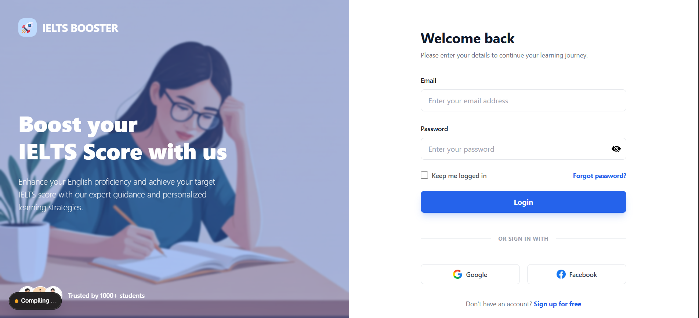
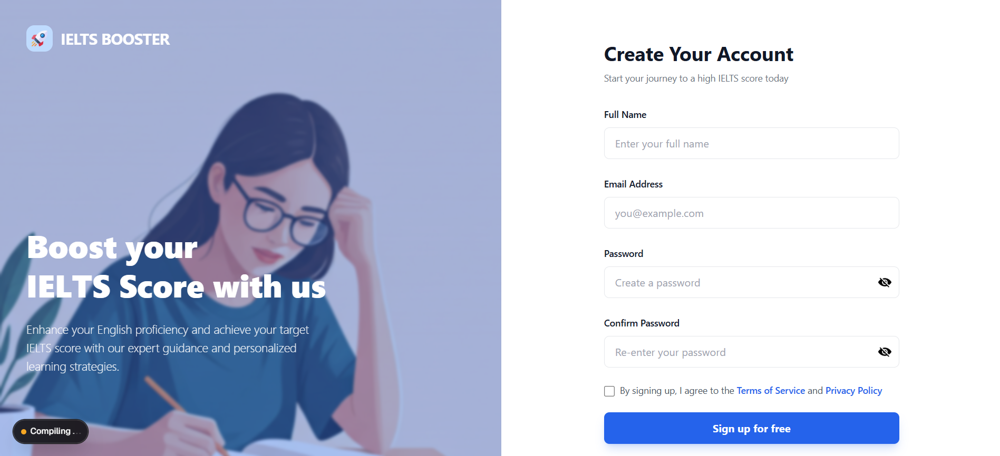
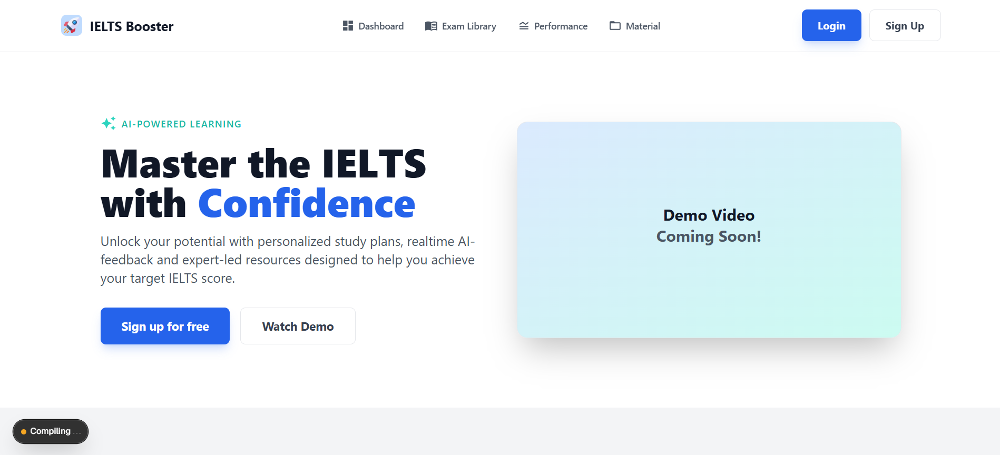
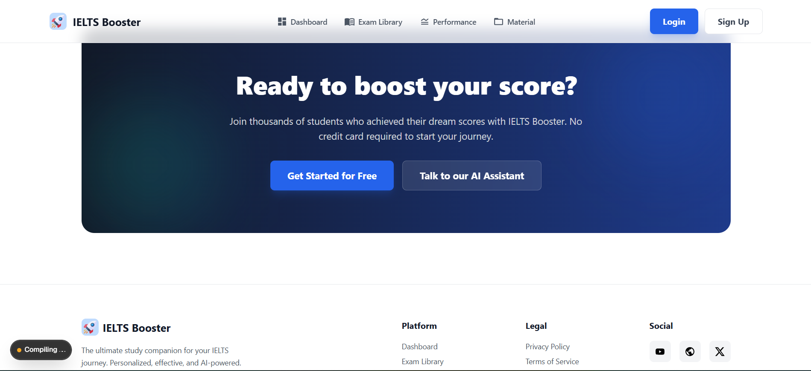
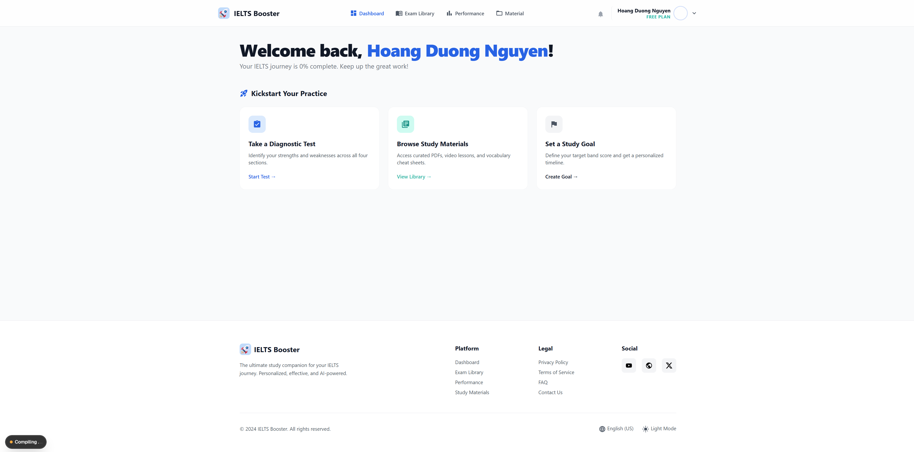

#  IELTS Booster - AI-Powered IELTS Practice Platform

An intelligent IELTS preparation platform featuring AI-powered scoring, real-time feedback, and comprehensive practice modules for all four IELTS sections.

## Project Overview

IELTS Booster is a full-stack web application designed to help students achieve their target IELTS band scores through:
- **AI-Powered Scoring**: Automated essay and speaking evaluation
- **Comprehensive Practice**: All 4 IELTS modules (Reading, Writing, Listening, Speaking)
- **Real-time Feedback**: Instant performance insights and improvement suggestions
- **Progress Tracking**: Detailed analytics and score history
- **Study Material**: List of necessary materials for IELTS
- **Individual Project** | Full-stack Project | 2025-2026

---

## Features

Authentication System:
- Full authentication flow with NextAuth.js
- JWT session management
- Route protection middleware
- Automatic redirects (logged in → dashboard, logged out → login)
- Session persistence and validation

Database Integration:
- PostgreSQL connected via Supabase
- Complete Prisma schema with all models
- User, Test, Score, Progress, StudyGoal models
- Secure API routes with validation

Dashboard Implementation:
- Professional dashboard UI
- Welcome banner with user info
- Continue Learning section with module gradients
- Quick Actions cards
- Error handling with retry mechanism
- Loading states
- Responsive design (mobile + desktop)

Header Component:
- Adaptive header (public vs authenticated)
- Navigation only shows when logged in
- Desktop dropdown menu for user profile
- Mobile hamburger menu
- All icons from constants
- Fully responsive

Components Architecture:
- Reusable Header and Footer
- Dashboard components (WelcomeBanner, ContinueLearning, QuickActions)
- All navigation and icons centralized in constants.js
- DRY principle followed throughout
- Easy to maintain and extend

Security:
- Password hashing with bcryptjs (12 rounds)
- Input sanitization
- Rate limiting
- SQL injection prevention (Prisma ORM)
- Protected API routes
- Environment variables secured

##  Tech Stack

### Frontend
- **Framework**: Next.js 15 (App Router)
- **Styling**: Tailwind CSS
- **UI Components**: Custom component library, MUI
- **State Management**: React Hooks

### Backend (Planed)
- **Authentication**: NextAuth.js v5
- **Database**: Prisma ORM with SQLite (dev) / PostgreSQL (production)
- **Password Security**: bcrypt
- **API**: Next.js API Routes

### AI Integration (Planned)
- **Essay Scoring**: OpenAI GPT-4 / Claude API
- **Speech-to-Text**: OpenAI Whisper API
- **Feedback Generation**: Custom prompts with LLM
